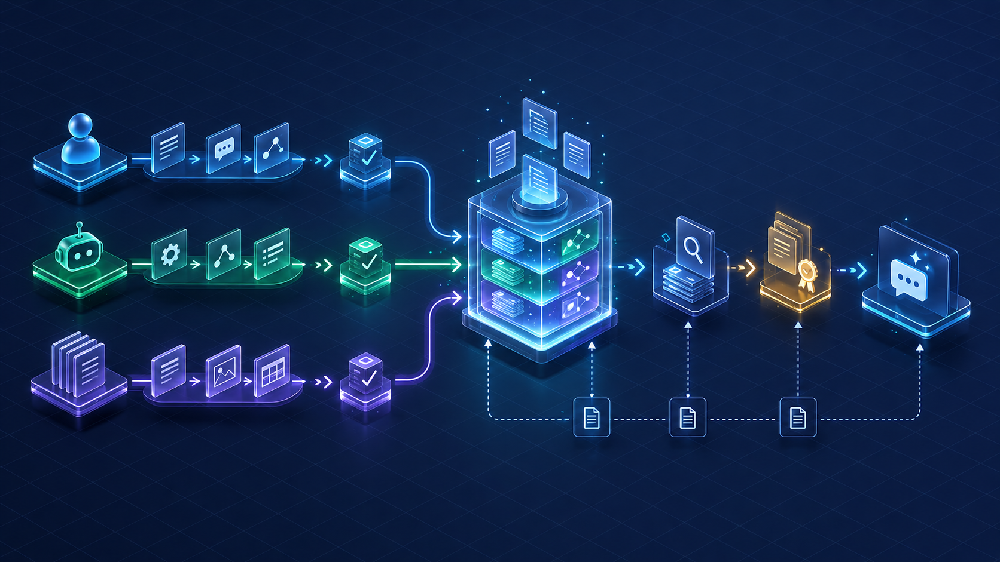
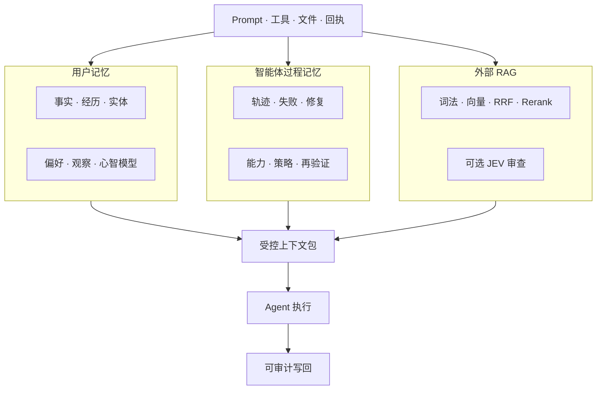
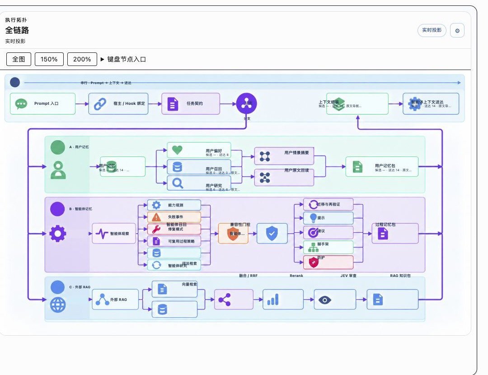
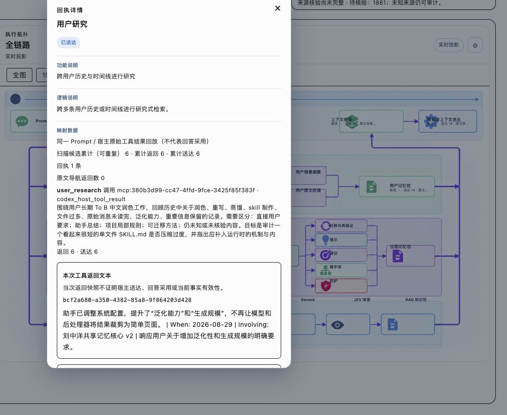
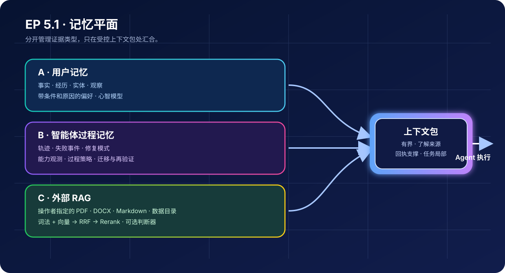
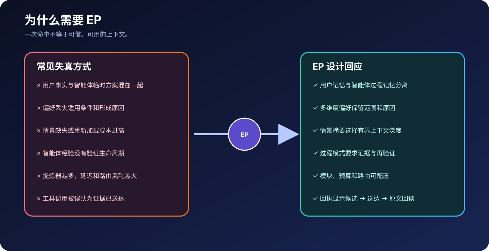

# Evolving Profile

> English: [README.md](README.md)

**普通记忆系统记住“说过什么”；Evolving Profile（EP）记住：哪些是证据、从哪条路线找到、是否真的送达、当前情境是什么，以及下一步怎样更可靠地行动。**




## 一句话理解

EP 不是把所有对话塞进一个向量库，而是把用户记忆、智能体过程记忆、情景上下文、外部资料、原文证据、工具回执和当前任务放在一条可审计的控制链中：

```text
当前 Prompt → 判断缺口 → 选择路线 → 召回候选 → 核对来源 → 组装上下文包
            → Agent 执行 → 用户/智能体写回 → 审计回执 → 最终回答
```

## 它解决什么痛点

- 相似度命中被误当成事实；
- 用户事实、项目局部决定和智能体临时方案混在一起；
- 情景摘要不完整，却把整个项目历史无边界注入；
- Recall 找到了候选，但候选没有返回、没有送达或没有回读原文；
- 调用了工具但返回 0 条，页面却无法区分“未调用”和“调用后为空”；
- 外部 PDF/Word 资料与 EP 内部记忆互相污染；
- 为弱模型准备的旧经验强行影响未来更强的新模型；
- 每轮都启用全部提炼器，带来 Token、延迟和路由混乱。

EP 的核心不是“记得更多”，而是让这些问题变成不同状态、不同证据和不同可修复路径。

## EP 的完整逻辑



### 三个记忆平面

1. **用户记忆**：事实、经历、实体与关系、观察、多维度偏好、心智模型和情景摘要。
2. **智能体过程记忆**：轨迹、失败事件、修复模式、能力观测、过程策略、迁移与再验证。
3. **外部 RAG**：只检索操作者指定的 PDF、DOCX、Markdown 和数据目录，不自动污染 EP 内部记忆。

三条路线可以在同一个上下文包中协同，但不会互相冒充来源。

### 证据状态必须分开

```text
候选 ≠ 已返回 ≠ 已送达 ≠ 已回读原文 ≠ 已确认答案采用
```

点击链路节点可以看到候选数、返回数、送达数、排除原因、相关度档位、策略版本、来源 ID 和原文回读状态。

## 真实链路和数据规模



上图来自真实中文控制台验收，展示了大规模记忆目录、事实/经历/实体数量、偏好与心智模型入口、用户记忆路线、情景判断、历史读取和回答汇聚。它不是静态架构图，而是实际页面中的可观察证据。



点击详情后，可以看到相关度最低阈值、记忆平面、返回/排除数量、强中弱相关分布、筛选原因和策略版本，解决“为什么召回、召回了什么、为什么没有送达”的问题。





## 情景摘要与原文回读

情景摘要不是事实来源，而是导航层：

```text
compact → standard → full → 有界 Session/Project 原文 → read_source
```

精确人名、金额、版本、状态、否定、冲突和正式交付内容，需要继续回读原文。摘要不完整时，不会默认把整个 Project 历史塞入上下文。

## 智能体过程记忆

```text
P0 轨迹 → P1 事件 → P2 失败事件 → P3 修复模式 → P4 技能候选
```

每条过程经验都带任务族、阶段、模型、工具、项目/Session 范围、前置条件、反例、验证质量、样本量和再验证记录。Agent 自己说“完成”不能单独升级为技能。

干预强度会随证据调整：`观察 → 提示 → 建议 → 脚手架 → 防护`。

## 外部 RAG 与 JEV

外部 RAG 支持词法检索、向量检索、RRF、Rerank、索引签名和重建提示。Embedding、Rerank、Provider/Fallback、JEV 都能在网页端独立配置。

JEV 是可选的后处理判断器，不负责召回和写入事实，可用于证据充分性、EP/RAG 路由、故障阶段和高风险门控。关闭或不可用时由确定性规则和明确的 unknown 状态托底。

## 环境要求

- macOS 或 Linux；
- Python 3.11+ 与 `uv`；
- Node.js 20+ 与 npm；
- 完整 API 数据平面需要 PostgreSQL；
- 可选的本地 Embedding/Rerank 运行时；
- 可选外部 RAG 目录；
- 用于 LLM 工作的 OpenAI-compatible 或其他 Provider。

## 部署方式

### 一键本地部署

```bash
./scripts/install-ep51.sh --mode local --no-launch
```

脚本会执行版本预检、依赖检查、脱敏扫描、Console 生产构建并生成本地启动清单。常用选项：

```bash
./scripts/install-ep51.sh --dry-run
./scripts/install-ep51.sh --mode local --skip-deps --no-launch
```

脚本不会导入生产 Bank、Prompt、Session、回执、API Key 或外部 RAG；JEV、云备份和外部 RAG 也不会被默认打开。

### 手动部署

```bash
cp .env.example .env
cd api && uv sync
cd ../console && npm ci
cd .. && npm run dev
```

然后打开：`http://127.0.0.1:9999`。首次运行请创建自己的 Bank，并在网页端配置 Provider、存储路径、备份、RAG 和语言。

## 给 Agent 的自动安装提示词

### Codex

```text
从 https://github.com/ccygod/evolving-profile-2.2 克隆 release/5.1.0 到新的目录。
执行 ./scripts/install-ep51.sh --mode local --skip-deps --no-launch，检查预检、脱敏
扫描和构建结果；通过后运行 npm run dev，并打开 http://127.0.0.1:9999。
不要导入任何生产 Bank、历史 Session、回执或 API Key。任何检查失败都要报告准确原因，
不能把安装失败说成完成。
```

### Claude Code

```text
使用 ccygod/evolving-profile-2.2 的 release/5.1.0 分支，在新目录完成本地安装。
先执行 scripts/install-ep51.sh 的预检与脱敏检查，再构建并启动 Console，打开
http://127.0.0.1:9999。通过共享 MCP/Hook 适配器接入前，不要复制私有对话、Bank、回执或 Key。
最后报告源码版本、测试结果和实际网页地址。
```

### Hermes

```text
使用 ccygod/evolving-profile-2.2 的 release/5.1.0 分支。
运行 ./scripts/install-ep51.sh --mode local --skip-deps --no-launch，按 api/README.md
启动 API/Console，并打开 http://127.0.0.1:9999。只有我明确配置后才能启用 JEV、外部 RAG、
云备份或生产记忆。
```

## 宿主兼容性

| 宿主 | 当前状态 | 边界与下一步 |
| --- | --- | --- |
| Codex | 当前验证最充分：MCP/Hook、链路图、场景摘要、Agent Recall/Research 和回执详情 | 继续增强原生答案采用回执 |
| Claude Code | 可通过 transcript/Hook bridge 复用 Controller、Recall/Research 和写回 | 下一版本增强安装向导、transcript 生命周期和诊断 |
| Hermes | 可通过 OpenAI-compatible/MCP 路线复用 Bank、Provider/Fallback、RAG/JEV 和审计契约 | 下一版本增加 Hermes 能力探针与专用配置向导 |

## 来源、个人仓库与作者

个人发行仓库：[ccygod/evolving-profile-2.2](https://github.com/ccygod/evolving-profile-2.2)，当前默认分支为 `release/5.1.0`，最新预发布版为 [`v5.1.0-rc.2`](https://github.com/ccygod/evolving-profile-2.2/releases/tag/v5.1.0-rc.2)。

上游协作渠道：[PR #4](https://github.com/94Hao94/evolving-profile/pull/4)。两者是同一条 EP 5.1 来源线：个人 fork 用于自有发布，上游 PR 用于贡献协作。`NOTICE.md` 记录公开发行作者/维护者为 CCY；GitHub 账号、仓库拥有者、上游项目拥有者和本机 Git 提交身份分开记录。

## 安全与边界

- 不要提交 `.env`、生产 Bank、私有 Prompt、Session transcript、回执、缓存或本机路径；
- 工具回执能证明调用、返回、送达和原文回读，不能在没有宿主答案采用回执时声称模型用了哪条候选；
- 情景摘要、过程模式和外部 RAG 结果都不能替代原始来源；
- JEV、外部 RAG、云备份和高风险门控都是独立配置，不打开不等于删除数据。

## 文档入口

- [English README](README.md)
- [5.1 发布说明](docs/RELEASE-NOTES-5.1.0.md)
- [唯一真相源](config/source-of-truth.json)
- [发布记录](docs/RELEASE-LEDGER.md)
- [安全策略](SECURITY.md)
