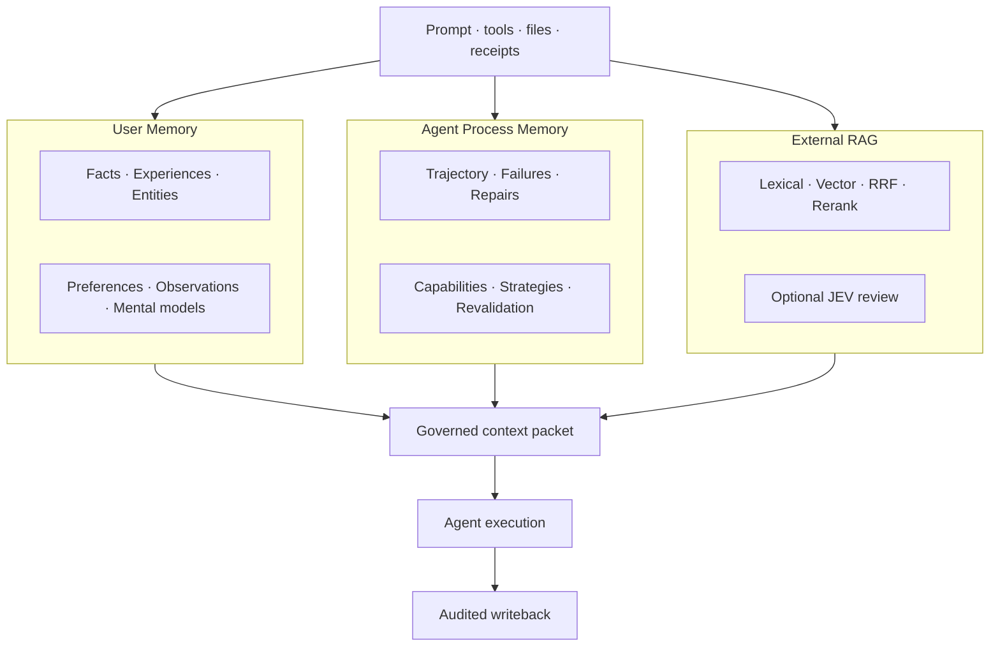
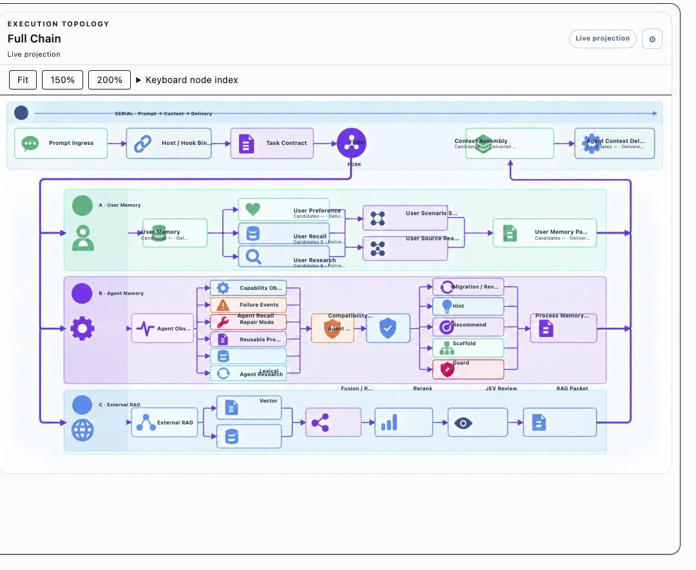
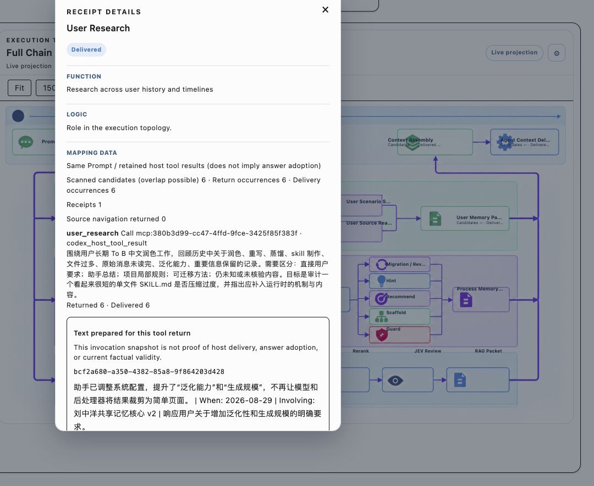

# Evolving Profile

<div align="center">

**Most memory systems remember text. EP remembers evidence, context, route, and the next safe action.**

Evidence-aware memory and execution observability for AI agents.


<a href="#quick-start">Quick start</a> ·
<a href="#how-it-works">How it works</a> ·
<a href="#agent-install-prompts">Agent install prompts</a> ·
<a href="#compatibility">Compatibility</a>

</div>

> **EP is not a bigger vector database.** It is a control plane that keeps user knowledge, agent experience, external documents, source evidence, delivery receipts, and current-task decisions separate until the exact moment they can be safely combined.

**中文说明：** [README-中文.md](README-中文.md)


## The problem EP solves

An AI agent can give a confident answer and still fail in several different ways:

- a similar memory is not the same thing as a verified fact;
- a project-local decision is mistaken for a global user preference;
- an agent's temporary workaround is mixed into the user's long-term memory;
- a useful candidate is found but never delivered to the agent;
- a tool returned zero rows, but the UI makes it look as if the tool was never called;
- a compressed Session summary hides the exact correction that mattered;
- an external PDF is mixed into internal memory and creates a duplicate or conflict;
- a pattern that helped a weaker model is forced onto a stronger, newer model;
- adding more extractors increases latency and token cost without increasing reliability.

EP makes these failure modes different, visible, and testable.

## The core idea

EP follows one evidence chain:

```text
current Prompt
  → task contract and host binding
  → choose the smallest useful memory route
  → retrieve candidates
  → verify scope and source
  → assemble a bounded context packet
  → execute
  → write back user/agent process evidence
  → expose an auditable receipt
```

The critical rule is:

```text
candidate ≠ returned ≠ delivered ≠ source-read ≠ answer-use confirmed
```

That separation lets an operator tell the difference between a bad retriever, an
admission filter, missing host delivery, an unavailable source, and a legitimate
empty result.

## Three memory planes, one controlled decision point



### User Memory

Facts, Experiences, Entities and Relations, Observations, multi-dimensional
Preferences, Mental Models, and Scenario Summary remain separate objects with
scope, source, time, conditions, and uncertainty.

### Agent Process Memory

Agent memory records what the agent tried, where it failed, how it repaired the
problem, what evidence verified the repair, and whether the result transfers to
another model, toolchain, project, or task family:

```text
P0 Trace → P1 Event → P2 Failure Episode → P3 Repair Pattern → P4 Candidate
```

The intervention ladder is adaptive: `observe → hint → recommend → scaffold → guard`.
No permanent strong/weak model list is required.

### External RAG

External RAG is an isolated operator-selected directory. EP memory is not its
document store, and external documents are not silently promoted into EP memory.
The route supports lexical search, local/online Embedding, vector search, RRF,
optional Rerank, index signatures, rebuild warnings, and optional JEV review.

## The execution topology

```text
Prompt → Hook binding → Task Contract → FORK
  ├─ User Memory: Preference / Recall / Research / Scenario / Source Readback
  ├─ Agent Memory: Observe / Recall / Research / Compatibility / Guidance
  └─ External RAG: Route / Lexical + Vector / RRF / Rerank / JEV
MERGE → Context Assembly → Agent Execution → Writeback → Audit → Answer
```



This is a real localized console capture, not a synthetic benchmark. It shows
large indexed-memory counts, route branches, context decisions, and the visible
distinction between waiting, observed, delivered, and unknown answer-use states.



Clicking a node exposes relevance floor, memory plane, returned/excluded counts,
relevance bands, filtering reasons, policy version, and source-readback state.

## Scenario Summary and source readback

Scenario Summary is a navigation layer, not a replacement for original history:

```text
compact → standard → full → bounded Session/Project history → read_source
```

Use `read_source` for exact wording, people, versions, amounts, status, conflict,
or any consequential claim. The system does not inject an entire project just
because a summary is incomplete.

## Configuration that respects cost and control

The web console separates User Memory modules, Agent Process Memory modules,
Provider/Fallback, Embedding/Rerank/RRF, external RAG, Scenario Summary, JEV,
backup policy, audit logs, and quality events. Every module can be disabled
without deleting its stored records. Retrieval and injection are separate
switches, so recording can continue while context cost is reduced.

## Quick start

### Requirements

- macOS or Linux;
- Python 3.11+ and `uv`;
- Node.js 20+ and npm;
- PostgreSQL for the full API data plane;
- an OpenAI-compatible or other configured provider;
- optional local Embedding/Rerank runtime and external RAG directory.

### One-command local package setup

```bash
./scripts/install-ep51.sh --mode local --no-launch
```

The installer runs release preflight, package/dependency checks, the secret and
personal-data scan, a production Console build, and writes a local launch
manifest. Use `--dry-run` to inspect commands, `--skip-deps` when dependencies
already exist, and `--no-launch` to build without starting services.

It never imports a production Bank, API key, session transcript, receipt, or
external RAG directory. JEV, cloud backup, and external RAG remain opt-in.

### Manual setup

```bash
cp .env.example .env
cd api && uv sync
cd ../console && npm ci
cd ..
npm run dev
```

Open the Console at `http://127.0.0.1:9999`. Configure a new Bank and provider
through the web UI. API details are documented in [api/README.md](api/README.md).

## Agent install prompts

Give one of these prompts to an agent with terminal and browser permission. Each
prompt asks it to install, verify, start the local web console, and open the URL;
none grants permission to copy private memory or enter credentials.

### Codex

```text
Install Evolving Profile from https://github.com/ccygod/evolving-profile-2.2
using release/5.1.0 in a new checkout. Run
./scripts/install-ep51.sh --mode local --skip-deps --no-launch, inspect the
preflight and secret-scan output, then start the Console with npm run dev.
Open http://127.0.0.1:9999 in the local browser. Do not import production Banks,
session transcripts, receipts, API keys, or external RAG directories. If any
check fails, report the exact failure instead of claiming success.
```

### Claude Code

```text
Clone https://github.com/ccygod/evolving-profile-2.2 at release/5.1.0 into a
new directory. Run scripts/install-ep51.sh preflight and package scanning, build
the Console, start it, and open http://127.0.0.1:9999. Use the shared MCP/Hook
adapter only after local checks pass. Never copy private transcripts, Banks,
receipts, or keys into the checkout. Report source, tests, and runtime URL.
```

### Hermes

```text
Use ccygod/evolving-profile-2.2 release/5.1.0 as the sanitized package. Run
./scripts/install-ep51.sh --mode local --skip-deps --no-launch, start API/Console
according to api/README.md, and open http://127.0.0.1:9999. Configure Hermes
through the documented OpenAI-compatible/MCP route only after the local check
passes. Do not enable JEV, cloud backup, external RAG, or production memory
unless I explicitly configure them.
```

## Compatibility

| Host | Current support | Boundary |
| --- | --- | --- |
| Codex | Highest-coverage path: native MCP/Hook, flow receipts, scenario/source review | Host-side answer-use may be unknown without a native receipt |
| Claude Code | Shared transcript/Hook bridge, Controller, Recall/Research, and writeback | Native transcript lifecycle and onboarding are next-version work |
| Hermes | Shared Bank, fallback, RAG/JEV, and audit contracts through OpenAI-compatible/MCP routes | Hermes capability probes and onboarding are next-version work |

“Compatible” means contracts and adapters can be reused; it does not claim
identical host receipts or identical answer-use visibility.

## Privacy, authorship, and source boundaries

This is a sanitized distribution. Do not commit `.env`, production Banks,
private prompts, session transcripts, receipts, caches, or local paths.

The personal distribution is maintained in
[`ccygod/evolving-profile-2.2`](https://github.com/ccygod/evolving-profile-2.2),
currently on `release/5.1.0` with prerelease `v5.1.0-rc.2`. The upstream contribution is
[PR #4](https://github.com/94Hao94/evolving-profile/pull/4). `NOTICE.md` records
CCY as the public distribution author/maintainer; GitHub account, repository
owner, upstream project owner, and local Git identity remain separate categories.

## Documentation map

- [Chinese README](README-中文.md) — localized diagrams, screenshots, and setup;
- [Release notes](docs/RELEASE-NOTES-5.1.0.md) — verification and limits;
- [Source of truth](config/source-of-truth.json) — authoritative stores;
- [Release ledger](docs/RELEASE-LEDGER.md) — personal prerelease and upstream PR;
- [Security policy](SECURITY.md) — keys, Banks, and distribution boundaries.
